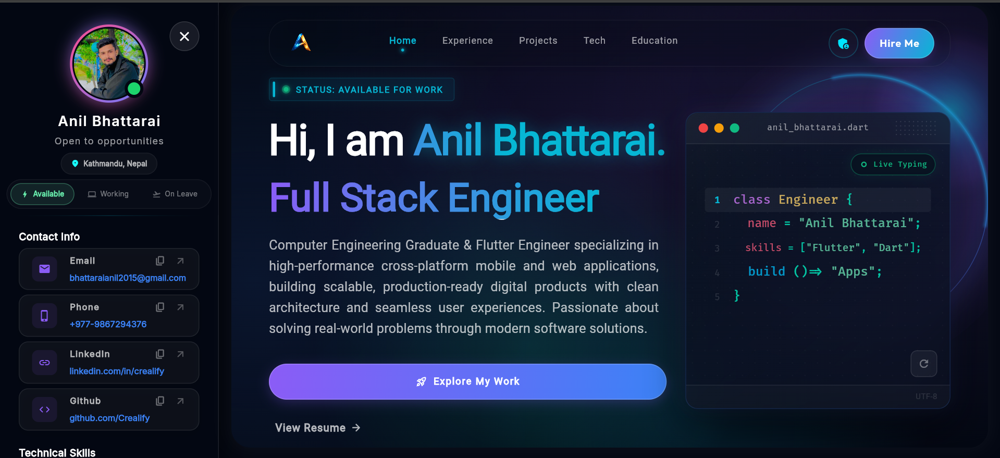

<div align="center">

# 🚀 Responsive Flutter Portfolio

**A premium, highly customizable, and cross-platform portfolio template built entirely with Flutter.**

[](https://flutter.dev/)
[](https://dart.dev/)
[](#)
[](https://opensource.org/licenses/MIT)
[](http://makeapullrequest.com)

<br>



> **Live Demo:** [https://www.anil-bhattarai.com.np](https://www.anil-bhattarai.com.np)

</div>

---

**Build your own portfolio in minutes with this complete starter code!** You don't need to build from scratch—just replace the dummy names, descriptions, and projects in the configuration files with your own, and you're ready to deploy. Whether you're a Mobile Developer, Web Engineer, or UI/UX Designer, this template allows you to showcase your skills and experience with a premium, engaging design.

---

## 📑 Table of Contents

- [✨ Key Features](#-key-features)
- [🛠️ Tech Stack & Dependencies](#️-tech-stack--dependencies)
- [📂 Project Structure](#-project-structure)
- [🚀 Getting Started](#-getting-started)
- [⚙️ Customization Guide](#️-customization-guide)
- [🌍 Deployment](#-deployment)
- [🤝 Contributing](#-contributing)
- [⭐ Show Your Support](#-show-your-support)

---

## ✨ Key Features

- **📱 Fully Responsive Design:** Fluid layouts that adapt beautifully to mobile phones, tablets, and wide-screen desktop monitors.
- **🎨 Modern UI/UX Aesthetics:** Integrates glassmorphism, dynamic gradients, smooth micro-animations, and 3D hover effects to create a premium feel.
- **⚡ Cross-Platform Capabilities:** Deploy a single codebase natively to Web, Android, iOS, Windows, macOS, and Linux.
- **🧠 State Management & Routing:** Powered by [GetX](https://pub.dev/packages/get) for ultra-fast performance, simple routing, and decoupled logic.
- **📦 Highly Modular & Customizable:** Every section (About, Skills, Projects, Experience, Education) is separated into its own model and controller. Simply update the configuration files to make the portfolio yours!
- **🌐 SEO Ready (Web):** Structured to allow easy implementation of Meta tags and OpenGraph data for better indexing.

---

## 🛠️ Tech Stack & Dependencies

| Category | Technology |
| :--- | :--- |
| **Framework** | [Flutter SDK](https://flutter.dev/) (Channel Stable) |
| **Language** | Dart |
| **State Management** | `get` (GetX) |
| **Animations** | `flutter_animate` |
| **Asset Handling** | `flutter_svg` |
| **Utilities** | `url_launcher`, `responsive_builder` (custom) |

---

## 📂 Project Structure

A quick look at the core architecture to help you navigate and customize:

```text
lib/
├── main.dart                  # Entry point of the application
├── model/                     # Data models (Projects, Skills, Education, Socials)
├── res/                       # Global resources (Constants, Colors, Typography)
├── view/                      # UI Screens and Widgets
│   ├── intro/                 # Hero section (Name, Title, CTA)
│   ├── main/                  # Global components (Drawer, Navigation)
│   ├── projects/              # Project showcase & bento grids
│   └── splash/                # Cinematic loading screen
└── view_model/                # State Controllers (GetX)
    ├── getx_controllers/      # Business logic and configurations
    └── responsive.dart        # Screen breakpoint logic
```

---

## 🚀 Getting Started

Follow these instructions to get a copy of the project up and running on your local machine for development and testing.

### Prerequisites

Ensure you have the latest version of Flutter installed.
- [Install Flutter](https://docs.flutter.dev/get-started/install)

Check your environment by running:
```bash
flutter doctor
```

### Installation

1. **Clone the repository:**
   ```bash
   git clone https://github.com/your-username/your-repo-name.git
   ```

2. **Navigate into the project directory:**
   ```bash
   cd your-repo-name
   ```

3. **Install dependencies:**
   ```bash
   flutter pub get
   ```

4. **Run the app (Chrome/Web is recommended for testing):**
   ```bash
   flutter run -d chrome
   ```

---

## ⚙️ Customization Guide

Make this portfolio your own in just a few simple steps!

### 1. Update Personal Data
Navigate to the `lib/view_model/getx_controllers/portfolio_controller.dart` or your respective configuration files in `lib/model/`. 
You can easily swap out the dummy data with your own:
- Name and Titles
- Social Links (GitHub, LinkedIn, Twitter, etc.)
- Contact Information
- Professional Experience & Education History

### 2. Add Your Projects
Modify the `projects` list inside your configuration. Provide titles, descriptions, and the necessary tech stack tags. Add screenshots to the `assets/images/` directory.

### 3. Swap Assets
Replace the placeholder images with your actual photos:
- **Profile picture:** `assets/images/placeholder.jpg`
- **Favicon and Web Icons:** Update the `web/` folder icons for production web builds.

### 4. Theme Colors
Change the primary theme colors by editing `AppConstants` in `lib/res/constants.dart`.

---

## 🌍 Deployment

### Deploying to GitHub Pages (Web)

1. Build the web version:
   ```bash
   flutter build web --release --base-href "/your-repo-name/"
   ```
2. Upload the contents of the `build/web` folder to the `gh-pages` branch of your repository.

### Deploying to Firebase Hosting

1. Initialize Firebase in your project directory:
   ```bash
   firebase init hosting
   ```
2. Build the app for production:
   ```bash
   flutter build web
   ```
3. Deploy!
   ```bash
   firebase deploy
   ```

---

## 📬 Contact

If you want to reach out to the developer of your new portfolio, make sure to update these links!

- **Email:** [your.email@example.com](mailto:your.email@example.com)
- **LinkedIn:** [Your Name](https://linkedin.com/in/yourprofile)
- **Twitter:** [@yourhandle](https://twitter.com/yourhandle)

---

## 🤝 Contributing

Contributions, issues, and feature requests are always welcome! 

1. Fork the Project
2. Create your Feature Branch (`git checkout -b feature/AmazingFeature`)
3. Commit your Changes (`git commit -m 'Add some AmazingFeature'`)
4. Push to the Branch (`git push origin feature/AmazingFeature`)
5. Open a Pull Request

---

## 📜 License

This project is open-source and available under the [MIT License](LICENSE). Feel free to use, modify, and distribute it for your own personal or commercial projects.

---

### ⭐ Show Your Support

If you love this portfolio template and find it helpful for your career, please give this repository a **Star**! It helps others discover the project and motivates further open-source contributions.

<br><br>

<div align="center">
  <b>Built with 💙 for the awesome Flutter Community.</b>
  <br>
  <i>Empowering developers to showcase their best work to the world.</i>
</div>